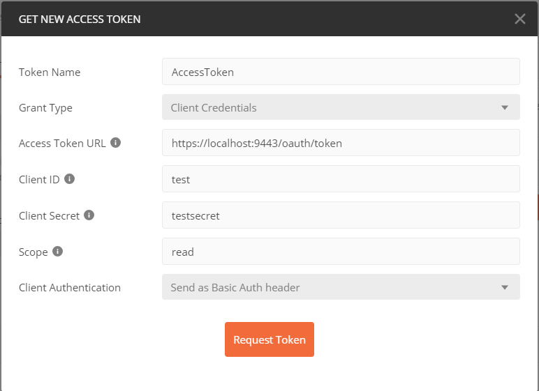

# Welcome to myRetail RESTful service

This proof fo concept(POC) is being done based on the following requirements:

*	Responds to an HTTP GET request at /products/{id} and delivers product data as JSON (where {id} will be a number. 
*	Example product IDs: 15117729, 16483589, 16696652, 16752456, 15643793) 
*	Example response: {"id":13860428,"name":"The Big Lebowski (Blu-ray) (Widescreen)","current_price":{"value": 13.49,"currency_code":"USD"}}
*	Performs an HTTP GET to retrieve the product name from an external API. (For this exercise the data will come from redsky.target.com, but let’s just pretend this is an internal resource hosted by myRetail) 

*	Example: http://redsky.target.com/v2/pdp/tcin/13860428?excludes=taxonomy,price,promotion,bulk_ship,rating_and_review_reviews,rating_and_review_statistics,question_answer_statistics
*	Reads pricing information from a NoSQL data store and combines it with the product id and name from the HTTP request into a single response. 

*	BONUS: Accepts an HTTP PUT request at the same path (/products/{id}), containing a JSON request body similar to the GET response, and updates the product’s price in the data store. 


# Getting Started

## Tech Stacks:
    * Spring boot 2.2.4.RELEASE
        * webflux
    * Embeded MongoDB
        * mongodb-reactive
    * Oauth2.0 - Client Credential 
    * Spock

The above tech stacks are being identified based on the following:

    * Reliability
    * Scalability
    * Maintainability

## Application Informations

There are total applications:

    1.  Oauth2.0 Authorization Server        
        * This application provides oauth access token for client credential and userInfo for authenticated users.
            * Aavailable Endpoints:
                1. Access token: /oauth/token : eg. http://localhost:8080/oauth/token
                2. UserInfo: /api/v1/authorize/user : eg. http://localhost:8080/api/v1/authorize/user
    2.  Products-Service       
        * This application provides Product Api for myRetails company.
            * Aavailable Endpoints:
                1.  GET request: /api/v1/products/{id} : https://localhost:8443/api/v1/products/13860427
                2.  PUT request: /api/v1/products/{id} : https://localhost:8443/api/v1/products/13860427
                    *  RequestBody: {"value": 124.23,"currency_code": "USD"}

## Usages                    
1. Get code checked out from git at command line
2. Navigate to appropiate application (myRetail-authorization-server or myRetail-products-service)folder.
3. Run Gradle clean Build command in cmd
4.  Finally Run Gradle bootRun command in cmd and wait for the application to start.
5. Once the application starts, Please use API testing application like POSTMAN to call authorization-server to get the access token using following:
     * 
     
     Note: current access token are valid for an hour
6. Next use that access token as bearer token for GET/PUT request to Product Api
     * 
     * 
     
Note: Please make sure to turn off the ssl certificate validation. Because Product Api uses self signed ssl cerificate for encrypted https channel.

# Development environment
    
## Eclipse

1. Get code checked out from git at command line
2. In eclipse Import as a gradle project
    1. File -> Import -> Existing Gradle Project . 
    2. Use all default options.
    3. Select the directory that you checked out.
    4. Wait for downloads
3. Run a gradle build
4. ... Steps to be determined from here ...

## Eclipse Formatter
    * spaces instead of tab 

## Groovy Support

1. Install Groovy 2.5.4([releases](http://groovy-lang.org/download.html#distro))
2. Set GROOVY_HOME and add GROOVY_HOME/bin to your path
3. Within eclipse install groovy plugin 

## Eclipse Gradle Plugin (Optional)

Gradle is required to build our application. If you are using the eclipse gradle plugin make the following configuration changes:
* Preferences -> Gradle -> set Specific Gradle Version to match the same version as your command line gradle (gradle --version)
* Preferences -> Gradle - set Gradle User Home 

